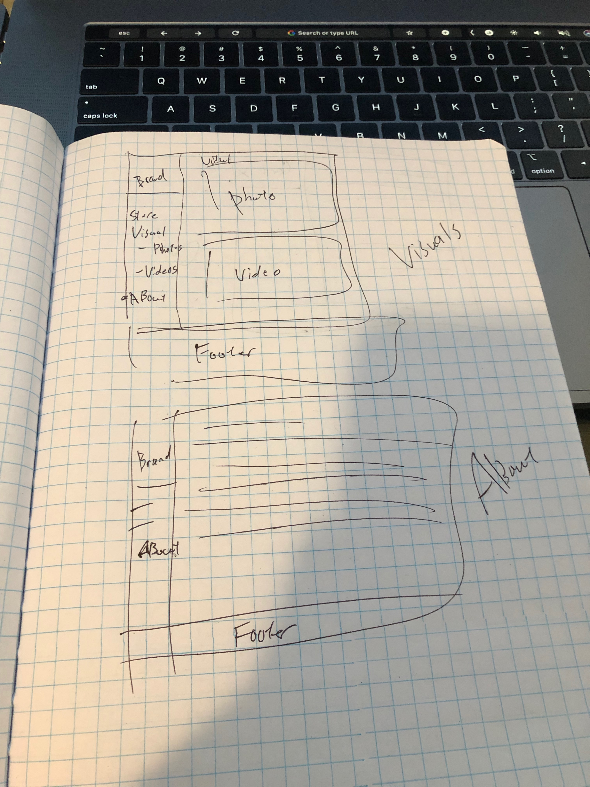
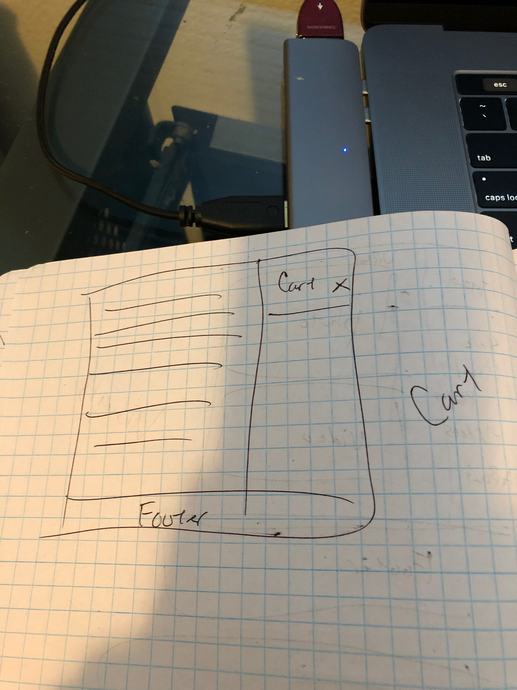
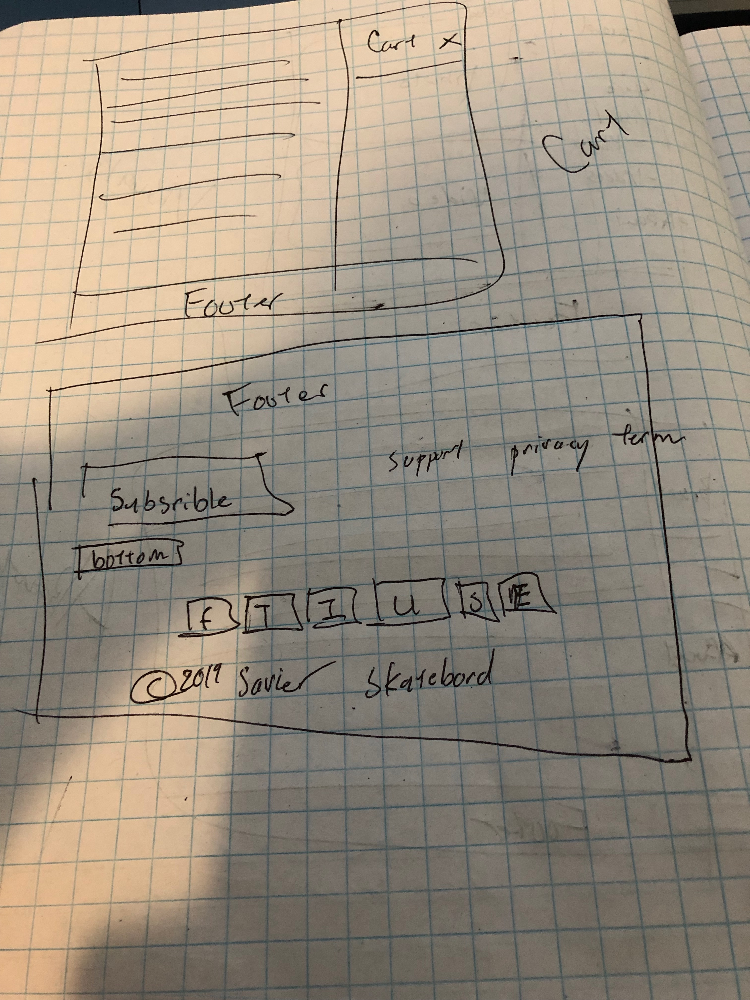
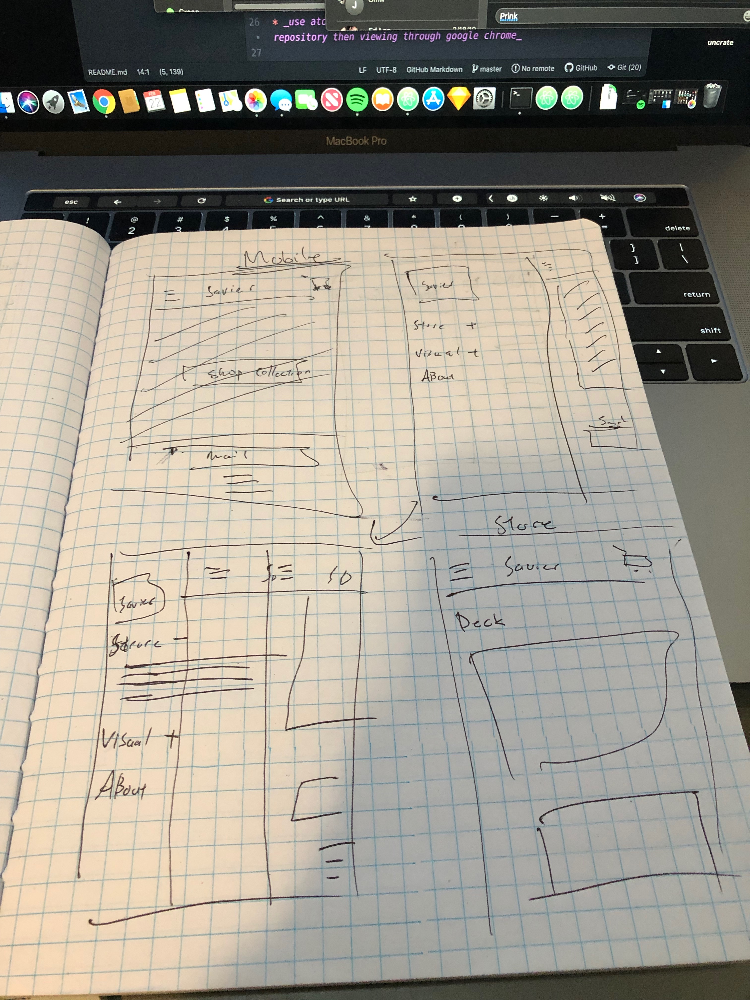
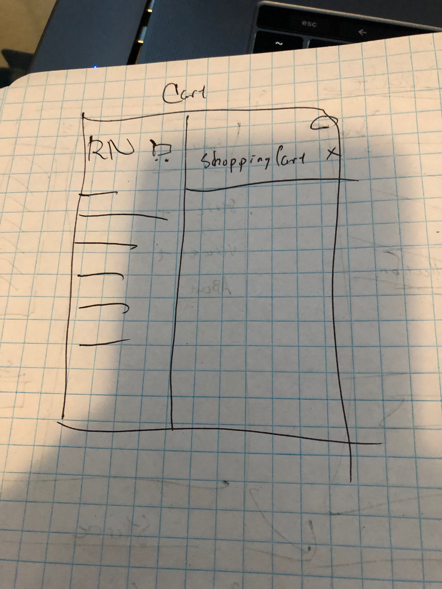
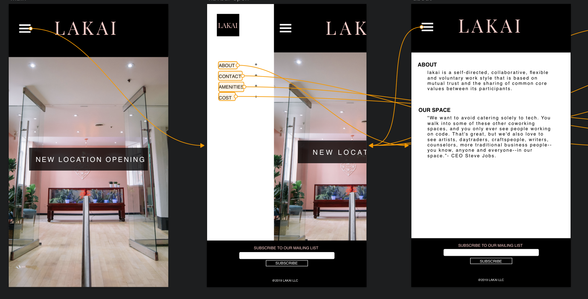
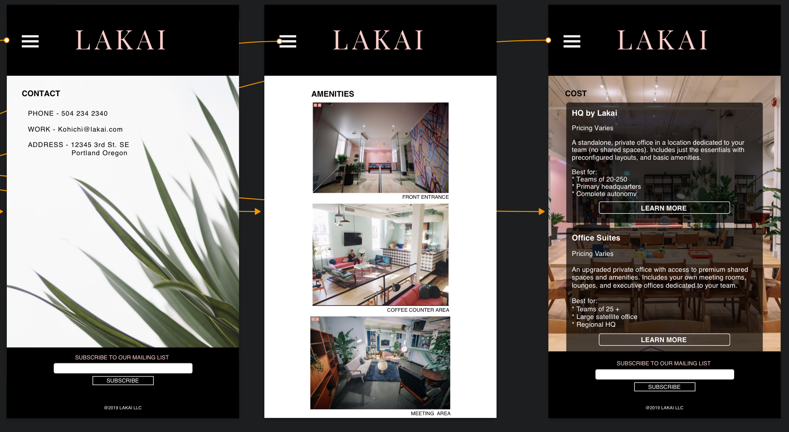
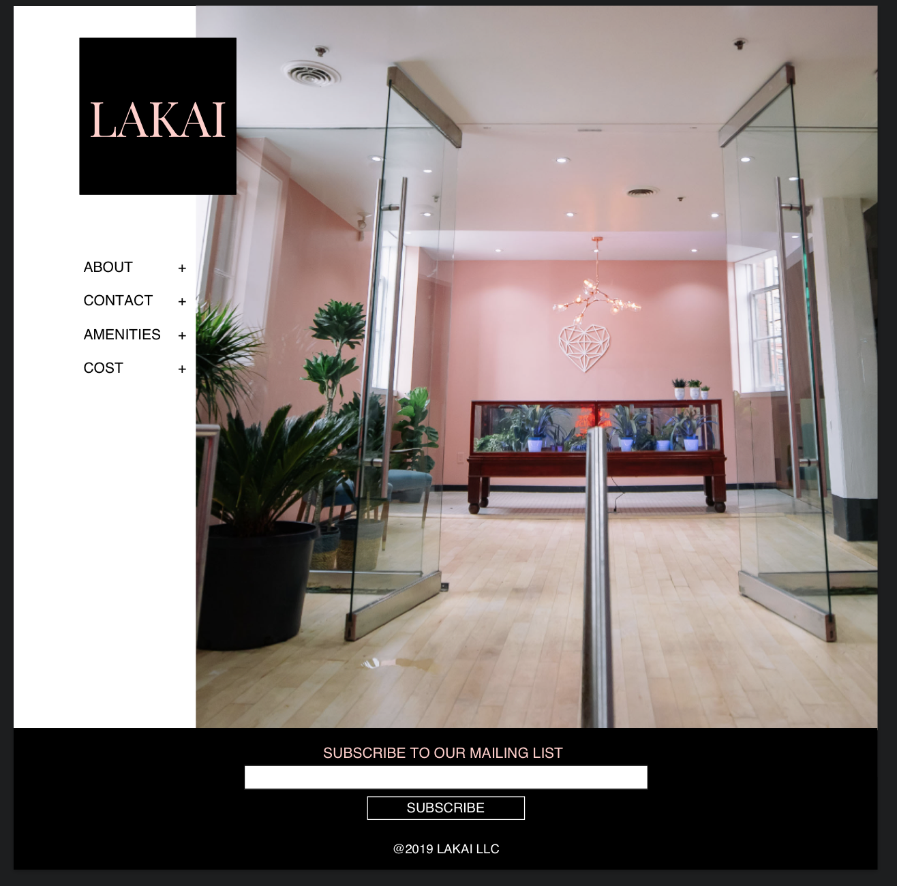
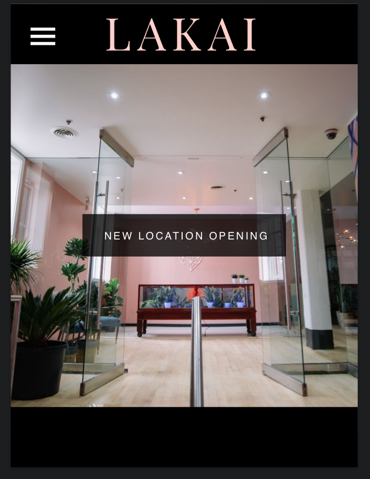

# _Lakai_

#### _A Designing a website for a company 2019_

#### By _** Kohichi Horii**_

## Description

* _The purpose of this project to be a freelance developer who is helping a company with their website._

### Images

* _Desktop Sketch view_

#### Mobile Version

* _Mobile Sketch view_

* _Mobile Wireframe_

#### Desktop Version

* _Desktop Wireframe_

#### Tablet Version

* _Tablet Wireframe_

## Target Users

* _Target users: potential members of the co-working space (freelancers, entrepreneurs and their employees, remote workers, creatives), co-working management_

* _We just finished remodeling our space, so We want to attract people that would really enjoy working in our environment._

* _We want our space--no, our whole company--to feel a little luxurious, cool, and high-end; yet still 100% welcoming and inclusive to everyone. A safe, comfortable, and productive work environment._

* _We have an on-site coffee counter, both communal working areas and private offices, high-speed internet, printing and faxing services._

* _We usually have a fun, optional activity on Thursday afternoons. Like yoga, maybe a fun complementary food, or like...I don't know, maybe even crafts sometimes (come make your own mini desktop terrarium)._

### Technologies and Resources

* _I looked up two different companies that also opened a co-working space and got ideas from their website_

* _Tech Space uses clean font and is easy to navigate through the site._

* _we work uses clean more bold font, is easy to navigate through the site and uses logos to show who they have worked with._

* _I used the software sketch to wireframe and also prototype the project_

### Responsiveness

* _When you are on the desktop view you can see the side Navigation bar the whole time. But once into tablet or mobile view the navigation will be at the top right corner. In mobile view the image will take up the whole width of the page_

### Setup Instructions

* _Clone Repository https://github.com/ko1h/lakai.git_
* _Github link_
* _Open folder_
* _Open index.html_
* _use atom to open up repository *look at webpage by opening up repository then viewing through google chrome_

### Roadmap

* _Footer is not finished in tablet version so I may work on that._

## Support and contact details

_If you are having issues you can contact us at kohichi.horii@gmail.com_

### License

*This software is licensed under the MIT license.*

Copyright (c) 2019 **_KH_** MIT license.
